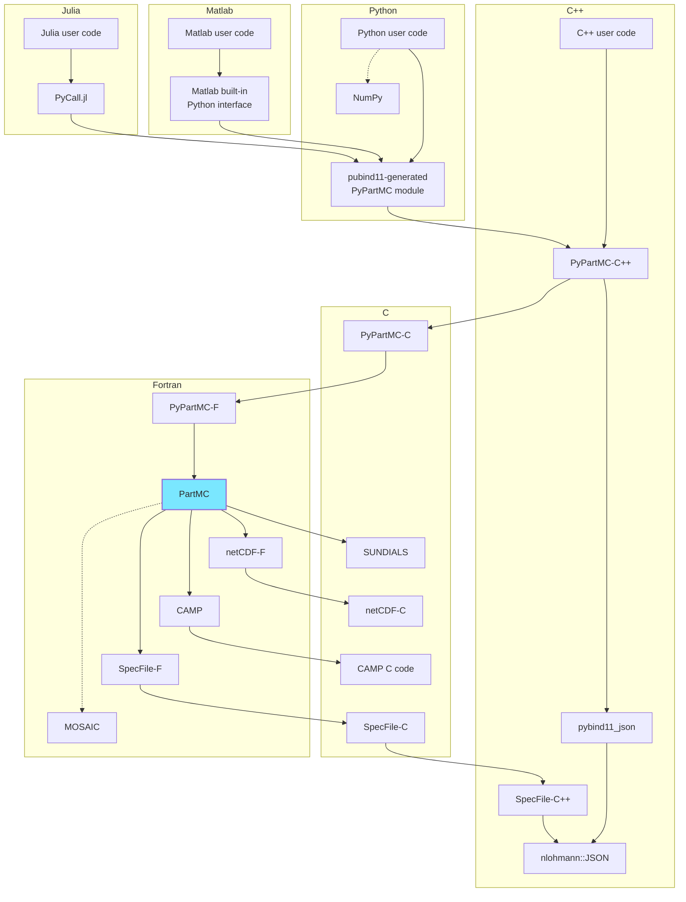

# notes for PyPartMC developers

## Implementation outline

- PyPartMC is written in C++, Fortran and uses [pybind11](https://pybind11.readthedocs.io/en/stable/) and [CMake](https://cmake.org/).
- JSON support is handled with [nlohmann::json](https://github.com/nlohmann/json) and [pybind11_json](https://github.com/pybind/pybind11_json)
- PartMC and selected parts of SUNDIALS are statically linked (and compiled in during `pip install` or `python -m build`) 
- C (SUNDIALS, netCDF), C++ (pybind11, ...) and Fortran (PartMC, CAMP, netCDF-fortran) dependencies are linked through [git submodules](https://github.com/open-atmos/PyPartMC/blob/main/.gitmodules)
- MOSAIC dependency is optionally linked through setting the environmental variable `MOSAIC_HOME`
- a [drop-in replacement of the PartMC spec file routines](https://github.com/open-atmos/PyPartMC/blob/main/src/spec_file_pypartmc.F90) is used for i/o from/to JSON 

## Implementation architecture



## How to debug
```sh
git clone --recursive git+https://github.com/open-atmos/PyPartMC.git
cd PyPartMC
DEBUG=1 VERBOSE=1 pip --verbose install -e .
gdb python 
(gdb) run -m pytest -s -vv -We -p no:unraisableexception tests
```

## Pre-commit hooks
PyPartMC codebase benefits from Pylint, Black and isort code analysis (which are all part of the CI workflows where we also use pre-commit hooks. The pre-commit hooks can be run locally, and then the resultant changes need to be staged before committing. To set up the hooks locally, install pre-commit via `pip install pre-commit` and set up the git hooks via `pre-commit install` (this needs to be done every time you clone the project). To run all pre-commit hooks, run `pre-commit run --all-files`. The `.pre-commit-config.yaml` file can be modified in case new hooks are to be added or existing ones need to be altered.

