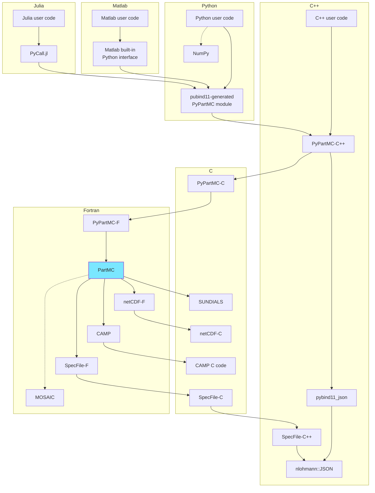

# PyPartMC

PyPartMC is a Python interface to [PartMC](https://lagrange.mechse.illinois.edu/partmc/), 
  a particle-resolved Monte-Carlo code for atmospheric aerosol simulation.
PyPartMC is implemented in C++ and it also constitutes a C++ API to the PartMC Fortran internals.
The Python API can facilitate using PartMC from other environments - see, e.g., Julia and Matlab examples below.

For an outline of the project, rationale, architecture, and features, refer to: [D'Aquino et al., 2023 (arXiv)](https://doi.org/10.48550/arXiv.2308.02052) (please cite if PyPartMC is used in your research).
For a list of talks and other relevant resources, please see [project Wiki](https://github.com/open-atmos/PyPartMC/wiki/).

[](https://asr.science.energy.gov/)
[](https://www.gnu.org/licenses/gpl-3.0.html)
[](https://atmos.illinois.edu/)
[](https://GitHub.com/open-atmos/PyPartMC/graphs/commit-activity)
[](https://github.com/open-atmos/PyPartMC/actions)
[](https://open-atmos.github.io/PyPartMC/)
[](https://doi.org/10.5281/zenodo.7662635)


## TL;DR (try in a Jupyter notebook)

[](https://www.python.org/)
[](https://en.wikipedia.org/wiki/Linux)
[](https://en.wikipedia.org/wiki/macOS)
[](https://en.wikipedia.org/wiki/Windows)
[](https://jupyter.org/)

```python
! pip install PyPartMC
import PyPartMC
```

#### Jupyter notebooks with examples 

- Urban plume scenario demo (as in [PartMC](https://github.com/compdyn/partmc/tree/master/scenarios/1_urban_plume)):
[](https://nbviewer.jupyter.org/github/open-atmos/PyPartMC/blob/main/examples/particle_simulation.ipynb)
[](https://colab.research.google.com/github/open-atmos/PyPartMC/blob/main/examples/particle_simulation.ipynb)
[](https://mybinder.org/v2/gh/open-atmos/PyPartMC.git/main?urlpath=lab/tree/examples/particle_simulation.ipynb)
- Dry-Wet Particle Size Equilibration with PartMC and PySDM:   
[](https://nbviewer.jupyter.org/github/open-atmos/PyPartMC/blob/main/examples/lognorm_ex.ipynb)
[](https://colab.research.google.com/github/open-atmos/PyPartMC/blob/main/examples/lognorm_ex.ipynb)
[](https://mybinder.org/v2/gh/open-atmos/PyPartMC.git/main?urlpath=lab/tree/examples/lognorm_ex.ipynb)
[](https://mybinder.org/v2/gh/open-atmos/PyPartMC/main?urlpath=voila%2Frender%2Fexamples%2Flognorm_ex.ipynb)

## Features

- works on Linux, macOS and Windows (compatibility assured with [CI builds](https://github.com/open-atmos/PyPartMC/blob/main/.github/workflows/tests.yml))
- hassle-free installation using `pip` (prior PartMC installation **not needed**)
- works out of the box on [mybinder.org](https://mybinder.org/), [Google Colab](colab.research.google.com/) and alike
- ships with [a set of examples](https://github.com/open-atmos/PyPartMC/tree/main/examples) maintained in a form of Jupyter notebooks
- Pythonic API (but retaining PartMC jargon) incl. Python GC deallocation of Fortran objects
- specification of parameters using native Python datatypes (lists, dicts) in place of PartMC spec files
- code snippets in README depicting how to use PyPartMC from Julia and Matlab (also executed on CI)
- auto-generated [API docs on the web](https://open-atmos.github.io/PyPartMC/)
- support for [de]serialization of selected wrapped structures using JSON 
- based on [unmodified PartMC code](https://github.com/open-atmos/PyPartMC/tree/main/gitmodules)
- does not use or require shell or any pre-installed libraries
- aiming at 100% [unit test coverage](https://github.com/open-atmos/PyPartMC/tree/main/tests)

## Usage examples

The listings below depict how the identical task of randomly sampling particles from an aerosol size distribution in PartMC can be
done in different programming languages.

For a Fortran equivalent of the Python, Julia and Matlab programs below, see the [`readme_fortran` folder](https://github.com/open-atmos/PyPartMC/tree/main/readme_fortran).

#### Python

```Python
import numpy as np

import PyPartMC as ppmc
from PyPartMC import si

aero_data = ppmc.AeroData((
    #      [density, ions in solution, molecular weight, kappa]
    {"OC": [1000 *si.kg/si.m**3, 0, 1e-3 *si.kg/si.mol, 0.001]},
    {"BC": [1800 *si.kg/si.m**3, 0, 1e-3 *si.kg/si.mol, 0]},
))

aero_dist = ppmc.AeroDist(
    aero_data,
    [{
        "cooking": {
            "mass_frac": [{"OC": [1]}],
            "diam_type": "geometric",
            "mode_type": "log_normal",
            "num_conc": 3200 / si.cm**3,
            "geom_mean_diam": 8.64 * si.nm,
            "log10_geom_std_dev": 0.28,
        }
    },
    {
        "diesel": {
            "mass_frac": [{"OC": [0.3]}, {"BC": [0.7]}],
            "diam_type": "geometric",
            "mode_type": "log_normal",
            "num_conc": 2900 / si.cm**3,
            "geom_mean_diam": 50 * si.nm,
            "log10_geom_std_dev": 0.24,
        }
    }],
)

n_part = 100
aero_state = ppmc.AeroState(aero_data, n_part, "nummass_source")
aero_state.dist_sample(aero_dist)
print(np.dot(aero_state.masses(), aero_state.num_concs), "# kg/m3")
```

#### Julia (using [PyCall.jl](https://github.com/JuliaPy/PyCall.jl))
```Julia
using Pkg
Pkg.add("PyCall")

using PyCall
ppmc = pyimport("PyPartMC")
si = ppmc["si"]

aero_data = ppmc.AeroData((
  #       (density, ions in solution, molecular weight, kappa)
  Dict("OC"=>(1000 * si.kg/si.m^3, 0, 1e-3 * si.kg/si.mol, 0.001)),
  Dict("BC"=>(1800 * si.kg/si.m^3, 0, 1e-3 * si.kg/si.mol, 0))
))

aero_dist = ppmc.AeroDist(aero_data, (
  Dict( 
    "cooking" => Dict(
      "mass_frac" => (Dict("OC" => (1,)),),
      "diam_type" => "geometric",
      "mode_type" => "log_normal",
      "num_conc" => 3200 / si.cm^3,
      "geom_mean_diam" => 8.64 * si.nm,
      "log10_geom_std_dev" => .28,
    )
  ),
  Dict( 
    "diesel" => Dict(
      "mass_frac" => (Dict("OC" => (.3,)), Dict("BC" => (.7,))),
      "diam_type" => "geometric",
      "mode_type" => "log_normal",
      "num_conc" => 2900 / si.cm^3,
      "geom_mean_diam" => 50 * si.nm,
      "log10_geom_std_dev" => .24,
    )
  )
))

n_part = 100
aero_state = ppmc.AeroState(aero_data, n_part, "nummass_source")
aero_state.dist_sample(aero_dist)
print(aero_state.masses()'aero_state.num_concs, "# kg/m3")
```

#### Matlab (using [Matlab's built-in Python interface](https://www.mathworks.com/help/matlab/python-language.html))

````Matlab
ppmc = py.importlib.import_module('PyPartMC');
si = py.importlib.import_module('PyPartMC').si;

aero_data = ppmc.AeroData(py.tuple({ ...
  py.dict(pyargs("OC", py.tuple({1000 * si.kg/si.m^3, 0, 1e-3 * si.kg/si.mol, 0.001}))), ...
  py.dict(pyargs("BC", py.tuple({1800 * si.kg/si.m^3, 0, 1e-3 * si.kg/si.mol, 0}))) ...
}));

aero_dist = ppmc.AeroDist(aero_data, py.tuple({ ...
  py.dict(pyargs( ...
    "cooking", py.dict(pyargs( ...
      "mass_frac", py.tuple({py.dict(pyargs("OC", py.tuple({1})))}), ...
      "diam_type", "geometric", ...
      "mode_type", "log_normal", ...
      "num_conc", 3200 / si.cm^3, ...
      "geom_mean_diam", 8.64 * si.nm, ...
      "log10_geom_std_dev", .28 ...
    )) ...
  )), ...
  py.dict(pyargs( ... 
    "diesel", py.dict(pyargs( ...
      "mass_frac", py.tuple({ ...
        py.dict(pyargs("OC", py.tuple({.3}))), ...
        py.dict(pyargs("BC", py.tuple({.7}))), ...
      }), ...
      "diam_type", "geometric", ...
      "mode_type", "log_normal", ...
      "num_conc", 2900 / si.cm^3, ...
      "geom_mean_diam", 50 * si.nm, ...
      "log10_geom_std_dev", .24 ...
    )) ...
  )) ...
}));

n_part = 100;
aero_state = ppmc.AeroState(aero_data, n_part, "nummass_source");
aero_state.dist_sample(aero_dist);
masses = cell(aero_state.masses());
num_concs = cell(aero_state.num_concs);
fprintf('%g # kg/m3\n', dot([masses{:}], [num_concs{:}]))
````

#### usage in other projects

PyPartMC is used within the [test workflow of the PySDM project](https://github.com/atmos-cloud-sim-uj/PySDM/tree/main/tests/smoke_tests/box/partmc).

## Implementation outline

- PyPartMC is written in C++, Fortran and uses [pybind11](https://pybind11.readthedocs.io/en/stable/) and [CMake](https://cmake.org/).
- JSON support is handled with [nlohmann::json](https://github.com/nlohmann/json) and [pybind11_json](https://github.com/pybind/pybind11_json)
- PartMC and selected parts of SUNDIALS are statically linked (and compiled in during `pip install` or `python -m build`) 
- C (SUNDIALS, netCDF), C++ (pybind11, ...) and Fortran (PartMC, CAMP, netCDF-fortran) dependencies are linked through [git submodules](https://github.com/open-atmos/PyPartMC/blob/main/.gitmodules)
- MOSAIC dependency is optionally linked through setting the environmental variable `MOSAIC_HOME`
- a [drop-in replacement of the PartMC spec file routines](https://github.com/open-atmos/PyPartMC/blob/main/src/fake_spec_file.F90) is used for i/o from/to JSON 

## Implementation architecture



## FAQ
- Q: Why `pip install PyPartMC` triggers compilation on my brand new Apple machine, while it quickly downloads and installs binary packages when executed on older Macs, Windows or Linux?    
  A: We are not yet providing binary wheels on PyPI for Apple-silicon (arm64) machines. Cross-compilation with gfortran is only supported with experimental unofficial builds [and is tricky](https://github.com/iains/gcc-12-branch/issues/23), while Github Actions ARM64 virtual machines are [costly](https://docs.github.com/en/billing/managing-billing-for-github-actions/about-billing-for-github-actions#minute-multipliers).  

- Q: Why some of the constructors expect data to be passed as **lists of single-entry dictionaries** instead of multi-element dictionaries?    
  A: This is intentional and related with PartMC relying on the order of elements within spec-file input; while Python dictionaries preserve ordering (insertion order), JSON format does not, and we intend to make these data structures safe to be [de]serialized using JSON.   

## Troubleshooting 

#### Common installation issues 
```
error: [Errno 2] No such file or directory: 'cmake'
```
Try rerunning after installing CMake, e.g., using `apt-get install cmake` (Ubuntu/Debian), `brew install cmake` (homebrew on macOS) or using [MSYS2](https://www.msys2.org/docs/cmake/) on Windows.

```
No CMAKE_Fortran_COMPILER could be found.
```
Try installing a Fortran compiler (e.g., `brew reinstall gcc` with Homebrew on macOS or using [MSYS2](https://packages.msys2.org/package/mingw-w64-x86_64-gcc-fortran?repo=mingw64) on Windows).

```
Could not find NC_M4 using the following names: m4, m4.exe
```
Try installing `m4` (e.g., using [MSYS2](https://packages.msys2.org/package/m4?repo=msys&variant=x86_64) on Windows).

## Notes for developers
#### How to debug
```sh
git clone --recursive git+https://github.com/open-atmos/PyPartMC.git
cd PyPartMC
DEBUG=1 VERBOSE=1 pip --verbose install -e .
gdb python 
(gdb) run -m pytest -s -vv -We -p no:unraisableexception tests
```
#### Pre-commit hooks
PyPartMC codebase benefits from Pylint, Black and isort code analysis (which are all part of the CI workflows where we also use pre-commit hooks. The pre-commit hooks can be run locally, and then the resultant changes need to be staged before committing. To set up the hooks locally, install pre-commit via `pip install pre-commit` and set up the git hooks via `pre-commit install` (this needs to be done every time you clone the project). To run all pre-commit hooks, run `pre-commit run --all-files`. The `.pre-commit-config.yaml` file can be modified in case new hooks are to be added or existing ones need to be altered.

## Credits

#### PyPartMC:

authors: [PyPartMC developers](https://github.com/open-atmos/PyPartMC/graphs/contributors)   
funding: [US Department of Energy Atmospheric System Research programme](https://asr.science.energy.gov/)   
copyright: [University of Illinois at Urbana-Champaign](https://atmos.illinois.edu/)   
licence: [GPL v3](https://www.gnu.org/licenses/gpl-3.0.en.html)

#### PartMC:
authors: [Nicole Riemer](https://www.atmos.uiuc.edu/~nriemer/), [Matthew West](https://lagrange.mechse.illinois.edu/mwest/), [Jeff Curtis](https://publish.illinois.edu/jcurtis2/) et al.   
licence: [GPL v2](https://www.gnu.org/licenses/old-licenses/gpl-2.0.html) or later

